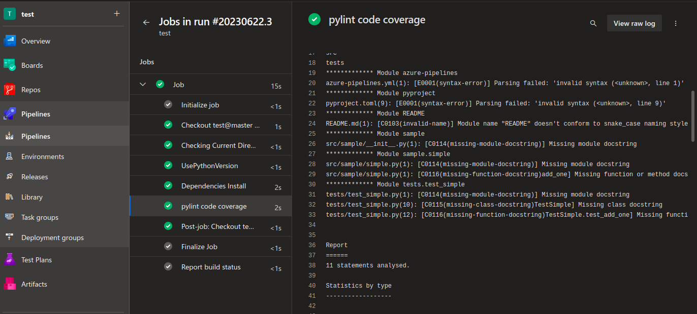
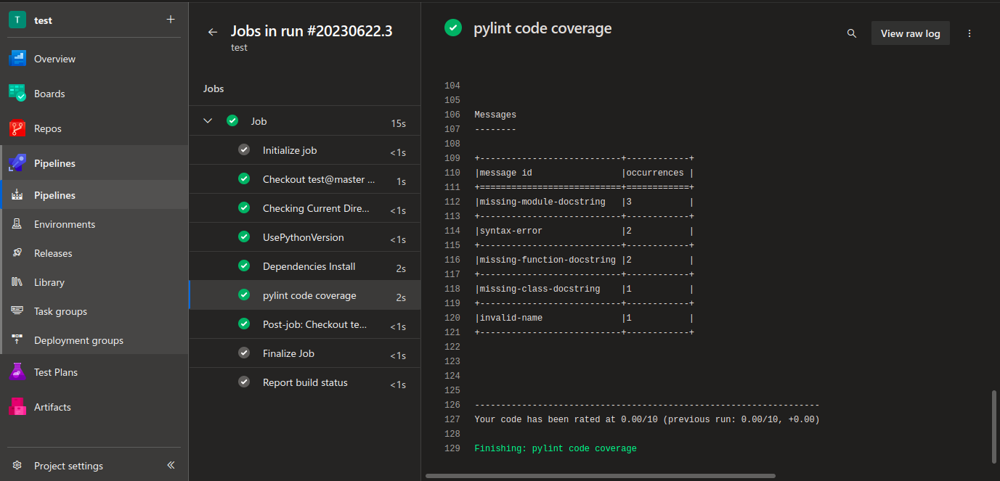

# Short Description about this template

In this techhub we are going to test the code coverage using the ADO pipeline for a simple python project and the coverage report store in the html format and report show in the table format and the code coverage result after test the code coverage.

# Steps for Execution 
1. clone the repository  
2. start the agent to run the pipeline.

As you can see in the below image firstly it will show the code coverage details.

It is also showing the report in the table format and give the overall code coverage result in my case the overall result is 0.0/10 .

